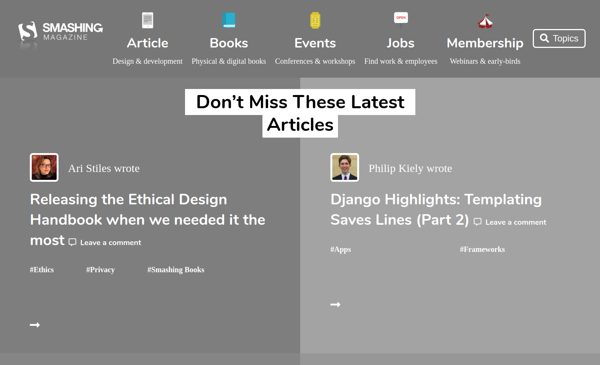

# Smashing Magazine clone grayscale

> this is a clone of the Smashing Magazine landing page in grayscale

This website contains:

- A Navbar made with flex.
- A main section made with grid.
- A footer made with flex.
- A authors and article section made with grid.

## Built With

- HTML5
- CSS3

## Authors

👤 **Luis Mauricio Fow Aranibar **

- Github: [@githubhandle](https://github.com/thedekerone)
- Twitter: [@twitterhandle](https://twitter.com/mauricio_fow)
- Linkedin: [linkedin](https://www.linkedin.com/in/mauricio-fow-aranibar-b2173514b/)

👤 **Muhammad Fahad Umer**

- Github: [@MFahadUmer](https://github.com/MFahadUmer)
- Twitter: [@engfahadumer](https://twitter.com/engfahadumer)
- Linkedin: [linkedin](https://www.linkedin.com/in/engineer-muhammad-fahad-e-umer-08813055/)

## Getting started

- Clone the repository with:
  `git clone git@github.com:MFahadUmer/smashing-magazine.git`

- See the original page here: https://www.smashingmagazine.com/

- Check the index.html to edit the structure of the page.

- Check the style.css to edit the style of any component.

## 🤝 Contributing

Contributions, issues and feature requests are welcome!

Feel free to check the [issues page](issues/).

## Show your support

Give a ⭐️ if you like this project!

## Live preview

You can check how the website looks in: https://rawcdn.githack.com/MFahadUmer/smashing-magazine/86fcb021316098682d351e80acd8d572a3c255ec/index.html
